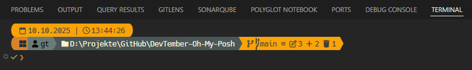
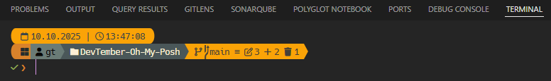

# 🍁 DevTember - A Cozy Oh My Posh Theme

A comfortable and functional Oh My Posh theme, inspired by the warm colors of autumn. Perfect for developers who appreciate a clean and organized terminal environment.

This theme comes in two variations to suit your preference for path display.

---

## 🎨 Variations

This theme is available in two styles for displaying the current path.

### Full

Displays the complete path to your current directory.
`D:\Projekts\GitHub\DevTember-Oh-My-Posh`



### Folder

Displays only the name of the current folder for a more compact view.
`DevTember-Oh-My-Posh`



---

## ✨ Features

- **🍂 Autumn Color Palette:** Enjoy warm, pleasant colors that are easy on the eyes during long coding sessions.
- **📑 Three-Line Layout:** A clean, multi-line structure that separates important information from your input area for maximum clarity.
- **🛠️ Developer-Focused:** Out-of-the-box support for essential tools:
  - Detailed **Git** status with icons for every state.
  - Automatic version display for **Node.js**, **Angular**, and **.NET**.
- **⚡ Admin Warning:** An instant visual indicator (`⚡`) appears when you're running a shell with administrative privileges.
- **✅ Command Status:** Immediately see if your last command was successful (✔) or failed (✘).

---

## 🚀 Installation

You can either install the theme directly from GitHub (recommended for easy setup) or by downloading the file locally. Choose the variation you prefer.

### Prerequisites

1. Make sure you have the latest version of **[Oh My Posh](https://ohmyposh.dev/docs/installation/windows)** installed.
2. You need a **[Nerd Font](https://www.nerdfonts.com/)** installed and set as the font in your terminal. (I recommend *FiraCode Nerd Font* or *CaskaydiaCove NF*).

### Quick Install (from GitHub)

This method loads the theme directly from the internet. Choose the line for the variation you prefer.

1. Open your PowerShell profile file.

    ```powershell
    notepad $PROFILE
    ```

2. Add **one** of the following lines to your profile:

    **For the Full version (complete path):**

    ```powershell
    oh-my-posh init pwsh --config "https://raw.githubusercontent.com/nrpieper/DevTember-Oh-My-Posh/main/devtember-full.omp.json" | Invoke-Expression
    ```

    **For the Folder version (only current folder):**

    ```powershell
    oh-my-posh init pwsh --config "https://raw.githubusercontent.com/nrpieper/DevTember-Oh-My-Posh/main/devtember-folder.omp.json" | Invoke-Expression
    ```

3. Save the file and reload your profile.

    ```powershell
    . $PROFILE
    ```

### Local Installation

This method uses a local copy of the theme file.

1. Download the theme file you want: `devtember-full.omp.json` or `devtember-folder.omp.json`.
2. Move the file into your Oh My Posh themes folder. You can find the path by running this command:

    ```powershell
    $env:POSH_THEMES_PATH
    ```

3. Open your PowerShell profile file.

    ```powershell
    notepad $PROFILE
    ```

4. Add the line corresponding to your downloaded file:

    **For the Full version:**

    ```powershell
    oh-my-posh init pwsh --config "$env:POSH_THEMES_PATH/devtember-full.omp.json" | Invoke-Expression
    ```

    **For the Folder version:**

    ```powershell

    oh-my-posh init pwsh --config "$env:POSH_THEMES_PATH/devtember-folder.omp.json" | Invoke-Expression
    ```

5. Save the file and reload your profile.

    ```powershell
    . $PROFILE
    ```
